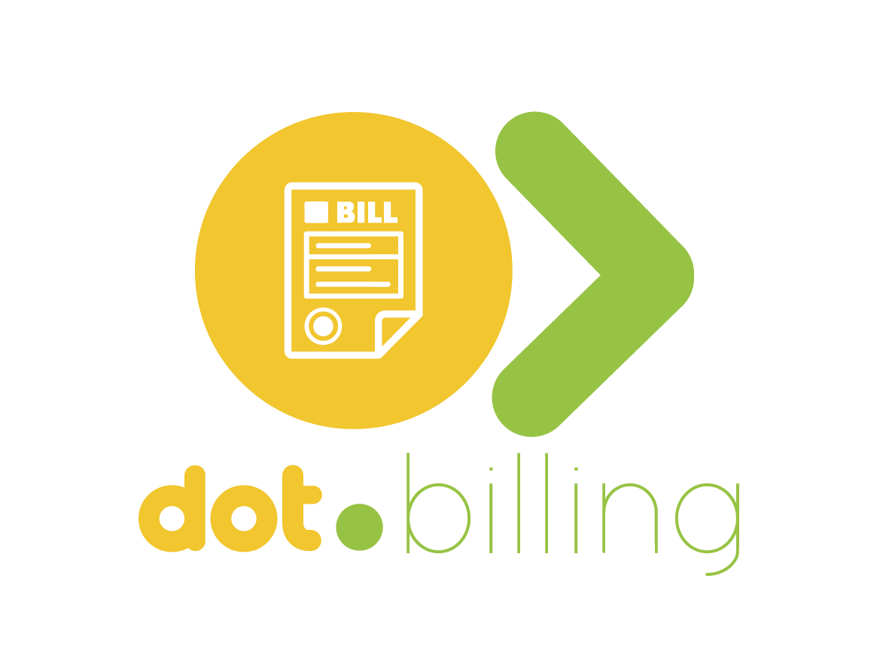

<div align="center">



<br /><br />

**Manage plans, track invoices, and analyse spend across the Dot ecosystem.**

<br />

   

<br /><br />

**Part of the [InfoDot Ecosystem](https://github.com/sakhileb/InfoDot)** &nbsp;·&nbsp; `billing.infodot.app`

</div>

---

## What is Dot.Billing?

Dot.Billing is the subscription and billing management platform in the InfoDot ecosystem. Teams track their active plans, receive and pay invoices, monitor cross-platform usage, and get AI-powered spend optimisation recommendations — all in one billing intelligence hub.

## Core Features

- Subscription management — plans, billing cycles, and trial tracking
- Invoice dashboard, search, and a per-invoice detail page with line items
- Usage-based billing — API calls, storage, and seat consumption per platform
- Payment methods — store and manage cards and EFT details
- Account credits and adjustment notes
- Budget alerts — configurable thresholds (`billing_alerts`)
- In-app notification bell (Laravel's `database` notification channel) for billing events
- Dark / light mode toggle (Tailwind class-based strategy, persisted per browser)
- AI spend analysis — Claude-powered cost optimisation recommendations
- Ecosystem SSO from InfoDot hub

> **Note:** invoice generation, payment processing, and Stripe integration are modeled in the
> schema (`stripe_*` reference columns) but not yet implemented — see `wiki.md` §4 for the current
> built-vs-modeled breakdown. "Invoice generation and payment tracking with Stripe" from earlier
> drafts of this README described the target state, not what ships today.

## Domain Models

- **BillingPlan** — subscription tier with features and pricing
- **BillingSubscription** — team-to-plan mapping with status
- **BillingInvoice** — generated invoice with line items
- **BillingUsageRecord** — per-platform metric consumption

## Tech Stack

| Layer | Technology |
|---|---|
| Framework | Laravel 12 |
| Language | PHP 8.4 |
| Frontend | Livewire 3 · Alpine.js 3 · Tailwind CSS |
| Database | PostgreSQL 16 (shared across ecosystem) |
| Realtime | Laravel Reverb (configured, not yet wired to any billing broadcast) |
| Auth | Laravel Sanctum (InfoDot SSO) + Jetstream/Fortify (teams, 2FA) |
| AI | Anthropic Claude (`claude-sonnet-4-6`), direct cURL via `AiBillingService` |
| Storage | Local (Flysystem); AWS S3 not currently configured |
| Search | Laravel Scout (dependency present; no search driver configured yet) |
| Queue | Database queue driver (`QUEUE_CONNECTION=database`); Redis/Horizon not installed |

## Quick Start

```bash
git clone https://github.com/sakhileb/Dot.Billing.git
cd Dot.Billing
cp .env.example .env
composer install
npm install && npm run build
php artisan key:generate
php artisan migrate
php artisan serve
```

> **Ecosystem SSO:** Set `DB_*` env vars to the shared InfoDot PostgreSQL instance and `APP_URL=https://billing.infodot.app`. Users authenticated through InfoDot gain access automatically via Sanctum handoff tokens.

### Running Tests

```bash
php artisan test
```

Feature tests use an in-memory SQLite connection (see `phpunit.xml`) and Laravel's default RefreshDatabase trait — no shared Postgres instance required to run them.

## Ecosystem

**Dot.Billing** is one of **21 platforms** in the InfoDot ecosystem, connected via shared PostgreSQL and Sanctum SSO. Visit [InfoDot](https://github.com/sakhileb/InfoDot) to explore the full platform map.

## License

MIT © [SK Digital / BluPin Incorporated](https://github.com/sakhileb)
